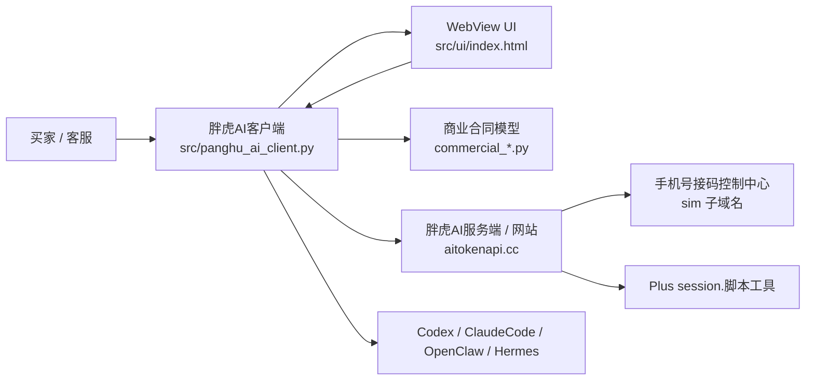

# 架构与工程边界

最后更新：2026-07-03

本文件覆盖系统架构、客户端后端、前端和设计边界（原 `BACKEND.md`、`FRONTEND.md`、`DESIGN.md` 已并入本文件）。

## 1. 事实来源

- 产品结构：`docs/PRODUCT_MANUAL_SINGLE_SOURCE_OF_TRUTH.md`
- 技术维护：`docs/TECHNICAL_MAINTENANCE_MANUAL.md`
- 商业合同：`docs/COMMERCIAL_BACKEND_API_CONTRACT.md`
- 当前源码：`src/`、`scripts/`、`tests/`
- 跨项目集成：`INTEGRATION.md`

## 2. 技术栈与模块划分

- Python 本地主程序和桥接层。
- 单文件 WebView UI：`src/ui/index.html`。
- pywebview 作为正式客户界面运行时。
- 本地测试使用 unittest / pytest / Node 结构检查。

本仓是桌面客户端源码仓。核心由三层组成：

- 客户端主程序：`src/panghu_ai_client.py`
- 客户端 WebView UI：`src/ui/index.html`
- 商业合同与离线验收模型：`src/commercial_core.py`、`src/commercial_api.py`、`src/commercial_backend_contract.py`

服务端网站、支付、钱包、数据库、后台管理、商品上架和真实代理结算不在本仓实现。

跨项目集成采用“客户端入口 + 服务端商业控制面 + 独立履约服务面”的结构。手机号接码控制中心负责接码控制台、手机卡/云号码、短信回传和设备 Agent；Plus session.脚本工具负责激活码兑换、Session Token 处理和 Plus 自动化履约。本仓只维护客户端入口、服务目录展示、WebView 会话桥接和客户可读状态，不直接保存或处理接码设备 token、短信内容、Plus Session Token、激活服务密钥、支付密钥或真实履约密钥。

## 3. 架构图与数据流



数据流：

1. 买家打开客户端并登录胖虎AI账号。
2. 本地主程序向胖虎AI服务端申请部署授权、权益、服务目录和代理中心快照。
3. Python bridge 将脱敏后的账号、权益、Agent 状态、服务入口和日志同步给 WebView UI。
4. Agent 配置、商业合同离线验收和本地交付状态由本仓代码处理；真实支付、账本、代理结算、接码和 Plus 履约由服务端或关联项目处理。

## 4. 运行面

正式客户界面必须使用 WebView UI。`src/panghu_ai_client.py` 负责启动、登录、授权、环境检测、配置写入、日志桥接和 Python 后端 API；`src/ui/index.html` 负责登录闸口、登录后业务导航、交互面板和前端状态展示。

缺少 pywebview 或 `src/ui/index.html` 资源时，应视为客户包启动/打包失败，不得静默回退到旧 Tkinter 业务界面，也不得自动打开系统浏览器冒充内置闭环。

## 5. 客户端后端范围（原 BACKEND.md）

本仓的“后端”主要是客户端本地 Python 逻辑和离线商业合同模型，包括：

- 胖虎AI登录与本地会话边界
- 部署授权请求
- Agent 清单、环境检测、风险插件检测
- Codex / ClaudeCode / OpenClaw / Hermes 配置和验收框架
- 商业 manifest 验签
- 权益、订单、配置会话、扣次和代理中心快照的离线合同守卫
- WebView UI 的 Python bridge

真实生产服务端、数据库、支付回调、钱包、商品后台、代理结算和平台官网不在本仓内。

### 5.1 路由、请求、响应、错误、鉴权

客户端面向服务端的路由、请求、响应、错误码和鉴权规则以 `docs/COMMERCIAL_BACKEND_API_CONTRACT.md` 与 `docs/TECHNICAL_MAINTENANCE_MANUAL.md` 为准。本文件不复制完整接口表，避免长期漂移。

维护要求：

- 登录、部署授权、更新清单、API Key、代理中心快照和增值业务入口都必须走胖虎AI服务端。
- 请求中不得夹带第三方账号密码、明文 API Key 日志、部署 token 持久化字段或本地伪造的订单/权益状态。
- 响应字段必须按白名单进入 UI；服务端未返回的商业数据不得由客户端补假值。
- 错误处理必须保留用户可理解提示，并避免把本地离线 mock 写成真实服务端成功。
- 鉴权失败时不得继续进入配置会话、扣次或交付完成状态。

### 5.2 环境变量与敏感信息

日常源码验证不要求设置生产密钥。涉及真实 Agent 对话验收时，API Key 只能通过临时环境变量传入，例如 `PANGHU_AGENT_ACCEPTANCE_API_KEY`，执行后必须清理。

敏感信息包括 API Key、部署 token、订单号、权益 ID、配置会话 ID、买家 cookie、第三方账号密码和签名私钥材料。它们不得进入文档、日志、截图、报告或长期本地配置。

### 5.3 数据迁移和回滚

本仓不维护生产数据库迁移。真实数据库迁移、回滚和账本修复属于胖虎AI服务端项目范围。

客户端本地回滚仅限配置写入前的本机快照恢复、失败后的配置恢复和构建产物回退；不能通过修改客户端本地文件回滚服务端订单、权益、账本或代理结算。

### 5.4 真实服务端待闭环项

以下事项不能用本地离线验收代替：

- 真实数据库和服务端账本。
- 真实支付回调和权益创建。
- 真实 Agent Runtime Adapter 和平台回调。
- 真实代理中心服务端快照。
- 客户真实账号、真实设备和端到端验收。

### 5.5 修改后最低验证

修改本地后端、商业合同、发布脚本或测试后，至少运行（完整命令见 `RUNBOOK.md`）：

```powershell
python src\panghu_ai_client.py --self-test
python scripts\commercial_flow_acceptance.py --json
python scripts\commercial_release_acceptance.py --json
python -m pytest -q
```

如果修改连接通讯软件合同，还要运行：

```powershell
python -m pytest tests\test_commercial_backend_contract_docs.py -q
```

## 6. 前端说明（原 FRONTEND.md）

### 6.1 页面、路由和当前入口

正式客户 UI 入口是 `src/ui/index.html`。主程序通过 `src/panghu_ai_client.py` 加载 WebView UI，并通过 Python bridge 向前端同步登录、账号、权益、Agent 状态、服务入口和日志。

当前页面是单文件 WebView UI，没有传统 Web 路由。模块切换由前端状态控制，等价入口路由为：

- `login`：未登录登录闸口。
- `agent-config`：配置Agent。
- `site-console`：胖虎AI网站。
- `value-added`：增值业务。
- `agent-center`：代理中心。

前端责任范围是客户本地 UI、状态展示、服务端入口承载、Python bridge 调用和本地截图验收；真实支付、数据库、代理结算、接码履约、Plus 履约和生产服务端状态不在本仓前端责任范围内。

### 6.2 必须保留的运行契约

前端改动必须保留：

- `#loginGate`
- `#consoleLayout`
- `window.updatePythonState(data)`
- `window.appendPythonLog(line)`
- `window.renderLogs()`

未登录前只能显示登录闸口；登录后一级模块必须覆盖：配置Agent、胖虎AI网站、增值业务、代理中心。

### 6.3 数据边界

前端只能展示后端或服务端返回的数据。不得在前端硬编码或本地计算：

- 商品价格、购买次数、有效期、设备数
- 返佣比例、返佣金额、代理等级、下游客户数、结算金额
- 商品上架状态、真实交付成功、真实履约状态
- API Key、token、密码、Session Token、短信内容或履约密钥

服务端未返回、返回 `pending_production` 或带 `unverified_reason` 时，前端只能显示待接入、待生产验收或人工复核。

### 6.4 模块职责

- 配置Agent：展示 Agent 配置流程、启动检测、最小中文对话和交付矩阵状态。
- 胖虎AI网站：承载控制台、创建 Key、充值购买、推广返佣、注册等服务端页面入口。
- 增值业务：承载 Plus 订阅、账号服务、手机卡 / 云号码、接码控制台、连接通讯软件等服务端下发入口。
- 代理中心：展示服务端下发的代理中心快照和入口，不本地计算代理规则。

连接通讯软件主配置入口固定在“配置Agent”模块内；增值业务只能做销售介绍和入口，代理中心不得承载该配置入口。

### 6.5 前端验证

当前没有独立前端 build 流程；前端 test 以结构检查、Python 自检、截图和相关 pytest 为主。结构检查和截图命令见 `TESTING.md` 与 `RUNBOOK.md`。

截图输出在 `outputs\panghu-installer-*.png`，属于可重建本地证据，不提交源码仓。截图只能证明本地前端状态，不能证明真实网页登录、支付、API Key 创建、代理中心服务端或客户交付闭环。

### 6.6 FRONTEND_EXECUTION_CARD

每次前端任务至少记录：

```yaml
FRONTEND_EXECUTION_CARD:
  target_view: login | agent-config | site-console | value-added | agent-center
  entry_route: src/ui/index.html
  states_covered: []
  components_touched: []
  forbidden_ui_areas:
    - 登录前 / 登录后分层
    - 四个一级模块
    - Python bridge 契约
    - 商业数据脱敏边界
  data_source: Python bridge / 服务端返回 / 本地过渡状态
  validation_command:
    - node structure check
    - python scripts\capture_ui_preview.py
  interaction_smoke: Unknown
  screenshot_evidence: outputs\panghu-installer-*.png
  unverified_states:
    - 真实网页登录
    - 真实支付
    - 真实 API Key 创建
    - 代理中心真实服务端
    - 客户机器真实交付
```

## 7. 设计边界（原 DESIGN.md）

设计 token 当前事实（来自产品手册和 `src/ui/index.html`；未确认项保持 Unknown，不编造）：

```yaml
colors:
  primary: "#0071E3"
  background: "#E8E8ED"
  surface: "#F5F5F7"
  sidebar: "#EBEBEC"
  border: "#D2D2D7"
  success: "#1A7F37"
  warning: "#B06000"
  warning_surface: "#FFF7DF"
typography:
  language: zh-CN
  letter_spacing: "0"
rounded:
  card_max: "8px"
unknown:
  spacing_scale: Unknown
  font_stack: Unknown
  motion_tokens: Unknown
```

设计原则：

- 胖虎AI客户端是客户交付软件控制台，不是营销落地页，也不是运维终端。界面需要让买家和客服都能快速判断：当前账号是谁、当前权益是什么、正在处理哪个业务、下一步做什么、交付是否通过。
- 允许由 Gemini / agy 或后续设计实现重组导航、面板、抽屉、命令区、状态区和日志区，但不能删除登录闸口、四个一级模块、账号 / 权益 / Agent 交付状态和可复制诊断日志。
- 界面默认中文。代码关键字、Agent 名称、API 字段和模型名可以保留英文。
- 界面保持控制台式层级，不使用无意义的装饰渐变、玻璃拟态或概念稿大装饰条。阴影和边框只服务于可读层级、模块分组和当前状态。
- 卡片圆角上限保持在 `8px` 左右；固定格式 UI 元素应有稳定尺寸，避免 hover、状态标签或动态内容导致布局跳动。
- 若要变更色彩系统，必须同步产品手册或在本文件记录变更来源。

关键组件职责：

- 登录闸口：账号、密码、注册入口、记住密码、自动登录、历史账号删除。
- 模块入口：配置Agent、胖虎AI网站、增值业务、代理中心。
- 当前任务区：显示当前步骤、下一步、状态和操作按钮。
- 权益 / 交付状态：显示服务端下发的账号、权益、Agent 五维状态和代理摘要。
- 日志 / 诊断：登录后可复制，且必须脱敏。

设计允许与禁止：

- 可以：重组布局提升业务密度和可读性；优化登录态、加载态、错误态、待接入状态和人工复核状态；用截图重新验收普通窗口、全屏窗口和四个业务模块。
- 禁止：登录前展示完整控制台；硬编码价格、次数、有效期、设备数、返佣、代理等级或真实交付成功；用旧截图或历史废弃内容作为当前 UI 验收依据；自动打开系统浏览器冒充内置浏览器闭环；把 Gemini / agy 包装成已完成配置交付。

截图验收需覆盖：登录闸口、配置Agent、胖虎AI网站、增值业务、代理中心、1365 宽度配置页。命令见 `RUNBOOK.md`。

## 8. 商业边界

客户端可以读取服务端下发的账号、权益、部署授权、业务入口和代理中心快照。客户端不能本地计算或承诺：

- 商品价格、购买次数、有效期、设备数
- token 返佣、激活返佣、安装返佣
- 代理等级、下游客户数、结算金额
- 商品上架状态或真实交付成功

相关守卫由商业合同代码、验收脚本和测试共同覆盖。

## 9. 构建与发布

本地构建脚本位于 `scripts/`，发布工作流位于 `.github/workflows/build-mac-release.yml`。当前源码整理不触发打包、Release、下载页或 `latest.json` 更新。发布条件和流程见 `RUNBOOK.md` 发布章节与 `docs/TECHNICAL_MAINTENANCE_MANUAL.md`。

`release/` 是本地客户包输出目录，不提交进源码仓；普通清理不得删除有效客户 zip。

## 10. 关键目录与文档结构

- `src/`：本地主程序、商业合同模型和 WebView UI。
- `scripts/`：运行、构建、截图和验收脚本。
- `tests/`：本地自动化测试。
- `docs/`：产品、技术和商业合同权威文档。
- `assets/`：客户包使用的图标和二维码素材。

根目录文档职责见 `AGENTS.md`（权威顺序）和 `HANDOFF.md`（文件分类盘点）。

## 11. 重要决策

- 正式客户 UI 只以 WebView UI 为准，不回退旧 Tkinter 业务界面。
- 胖虎AI客户端是主产品，胖虎AI中转站、接码、Plus、连接通讯软件和代理中心都是客户端承接的功能区或分支服务。
- 本地验证、截图和离线合同不能冒充真实客户闭环、生产验收或发布完成。

## 12. 禁止改动区

- `src/ui/index.html` 的 Python bridge 契约、登录前 / 登录后分层、四个一级模块。
- API Key、密码、token、Session Token、短信内容和履约密钥的脱敏边界。
- 不要修改生产、支付、数据库、账号、密钥、客户数据、Release、下载页或 `latest.json`，除非用户明确进入对应阶段并授权。
- 不要删除、移动、重命名、归档文件，除非先列清单并获得用户确认。
- 不要把 `src/ui/index.html` 当成 mock 文件忽略；它是客户包运行资产。
- 不要把历史截图、旧 handoff 或聊天上下文当成当前架构权威。
- 不要为了视觉整理改动商业规则、服务端合同、扣次、支付、账号或生产入口。
