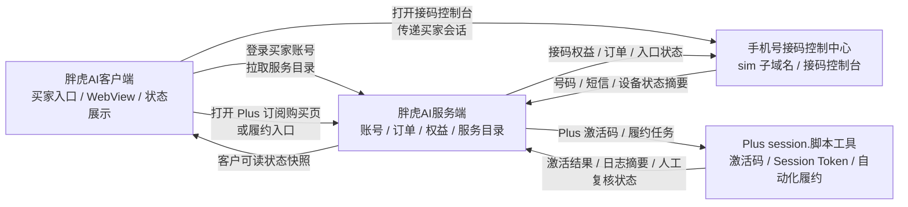

# 跨项目集成说明

最后更新：2026-07-03

本文说明“胖虎AI客户端”如何关联“手机号接码控制中心”和“Plus session.脚本工具”。它是当前源码仓的集成主控说明，不替代各项目自己的产品手册、运行手册和部署清单。

## 0. 产品主从口径

- 胖虎AI客户端是主产品、客户统一入口和顶部业务容器。
- 胖虎AI中转站、手机号接码、Plus 充值 / Plus 订阅、连接通讯软件、代理中心都属于胖虎AI客户端内的功能区或分支服务。
- 胖虎AI中转站只承接 API 网关、API Token、余额扣费、模型调用、用量记录、模型价格、网关侧充值记账和必要 token 返佣，不写成胖虎AI平台主后台、胖虎AI客户端后台或整个平台后台。
- 独立胖虎AI后台管理系统负责账号、订单、支付、权益、代理、服务目录、运营配置和各分支服务编排。
- 手机接码、Plus 充值 / Plus 订阅和连接通讯软件是接入客户端的独立分支服务，不从属于胖虎AI中转站；中转站只保留必要跳转、摘要或接口合同。

## 1. 总体原则

- 胖虎AI客户端是买家统一入口，负责登录、展示服务入口、打开内置 WebView、展示服务端状态和引导客户继续操作。
- 胖虎AI服务端是商业控制面，负责账号、订单、支付、权益、服务目录、服务状态、卡密发放、代理归因和客服诊断。
- 胖虎AI中转站是 API 网关分支服务，负责 API Token、余额扣费、模型调用、用量记录、模型价格、网关侧充值记账和必要 token 返佣。
- 手机号接码控制中心是接码分支服务面，负责手机卡、云号码、号码托管、短信回传、设备 Agent、审计和接码业务闭环。
- Plus session.脚本工具是 Plus 充值 / Plus 订阅分支服务的履约执行面，负责激活码兑换、Session Token 接收、Plus 自动化执行、续费取消和履约日志。
- 客户端不得把价格、库存、号码分配、短信内容、Plus Session Token、激活码密钥、支付结果或真实履约成功写死在本地。

## 1.1 集成总控机制

跨项目功能接入统一按这个机制推进：

1. 胖虎AI客户端只承载统一登录、统一导航、WebView 会话桥接、服务端目录展示和客户可读状态摘要。
2. 每个独立功能项目必须提供一张“接入卡”，说明自己的服务 ID、入口 URL、当前状态、数据边界、密钥边界、验收门和未完成项。
3. 胖虎AI服务端用 `value_added_services` 或对应业务目录把服务下发给客户端；客户端不得绕过服务端目录自行判断服务是否可售、可用或已交付。
4. 每个功能项目继续在自己的仓库完成产品、后端、设备、生产、履约和验收；客户端仓不直接修改其它项目的生产部署状态。
5. 主控窗口只在本文件维护“谁接入哪里、入口怎么暴露、哪些状态可以给客户看、什么条件才能说完成”；功能项目窗口维护自己的真实实现和证据。
6. 后续新功能必须先补接入卡，再接客户端入口或服务端目录；没有接入卡的功能不得写成已接入。

接入卡最小字段：

```yaml
service_id:
title:
subtitle:
category:
sort_order:
primary_action_label:
disabled_reason:
support_hint:
client_module:
secondary_entry:
target_project:
project_registry_file:
service_type:
entry_url:
summary_url:
status:
entitlement_status:
product_id:
order_id:
entitlement_id:
purchase_url:
activation_url:
delivery_status:
refund_status:
manual_review_reason:
requires_webview_session:
min_client_version:
version:
data_owner:
secret_owner:
client_allowed:
client_forbidden:
acceptance:
safe_display_fields:
rollback_plan:
change_log_ref:
unverified_reason:
last_verified:
```

状态口径：

- `draft`：只有想法或产品草案，不展示给客户。
- `pending_integration`：项目接入卡或服务端目录仍在补齐，客户端可显示为待接入。
- `sandbox_ready`：本地或测试环境可演示，不能对生产客户承诺。
- `pending_production`：本地或项目侧已完成主要能力，但生产设备、DNS、数据库、密钥、真实履约或端到端验收未完成。
- `available`：已有生产入口、服务端目录、真实履约链路和端到端验收。
- `manual_review`：可人工处理，但自动闭环未完成。
- `paused`：暂不对客户开放。
- `deprecated`：保留兼容或迁移提示，不再销售新订单。
- `blocked`：缺少必要授权、服务端接口、生产资源或业务决策。

客户端展示规则：

- `available` 才能显示为可用服务。
- `draft` 不展示给客户。
- `pending_integration`、`sandbox_ready`、`pending_production`、`manual_review`、`paused`、`deprecated`、`blocked` 必须显示待接入、测试中、待生产验收、人工复核、暂停、迁移或阻塞原因。
- `unverified_reason` 不为空时，客户端不得把服务写成已交付。
- `min_client_version` 高于当前客户端版本时，只能显示升级提示，不能显示可用入口。
- `deprecated` 必须带 `deprecation_notice` 或 `replacement_service_id`。

## 2. 业务关系图



## 3. 客户端内的入口关系

| 客户端模块 | 客户可见入口 | 关联项目 | 当前正确职责 |
| --- | --- | --- | --- |
| 增值业务 | Plus 订阅 | Plus session.脚本工具 | 打开服务端购买页或履约入口，展示激活/履约状态，不接收或保存 Session Token |
| 增值业务 | 国外手机卡 / 云号码 | 手机号接码控制中心 | 打开服务端销售或号码服务页，价格、库存、号码分配由服务端控制 |
| 增值业务 | 接码控制台 | 手机号接码控制中心 | 打开 `sim` 子域名控制台，短信回传和设备状态由接码服务端控制 |
| 配置Agent | 连接通讯软件 | 胖虎AI服务端独立增值服务 | 配置和验收入口固定在配置Agent模块，不与接码或 Plus 履约混用 |

入口归属规则：

- `primary_module=增值业务` 的服务可以展示购买、进入、查看状态、人工复核等入口，但配置和履约是否可直接在本模块完成，要看服务端目录。
- `primary_module=配置Agent` 的服务只允许在配置Agent模块执行配置或验收；增值业务模块最多显示销售介绍卡。
- `sales_card_only=true` 时，客户端只能显示介绍或购买入口，不能显示“开始配置”。
- `delivery_entry` 必须指向真正履约位置，例如 `sim` 控制台、Plus 履约入口或连接通讯软件配置页。
- `secondary_entry` 只做模块内定位，不得把服务复制到多个模块造成状态不一致。

## 3.1 当前接入卡总表

| service_id | 客户可见入口 | 关联项目 | 项目接入卡 | 当前总控状态 |
| --- | --- | --- | --- | --- |
| `sms_code` | 接码控制台 | 手机号接码控制中心 | `C:\Users\Administrator\Documents\codex\手机号接码控制中心\docs\胖虎AI客户端接入卡.md` | `pending_production`，公网 `sim` 入口已可健康检查，但真实设备在线、正式设备 token、真实买家接码端到端仍未验收 |
| `phone_card` | 国外手机卡 / 云号码 | 手机号接码控制中心 | 同 `sms_code` 接入卡 | `pending_production`，商品/套餐/托管服务由接码项目承载，价格、库存、号码分配必须走服务端 |
| `gpt_plus` | Plus 订阅 | Plus session.脚本工具 | 待在 Plus 项目补齐 | `pending_production`，支付发码、激活服务、履约队列、日志回写和人工复核仍未完成生产闭环 |
| `communication_software_link` | 连接通讯软件 | 胖虎AI服务端独立增值服务 | 待在服务端/客户端合同补齐 | `manual_review` 或 `pending_production`，必须独立订单、独立配置会话和独立验收 |
| `agent_center` | 代理中心 | 胖虎AI服务端 / 代理业务后台 | 待在服务端合同补齐 | `pending_production`，客户端只显示服务端 `agent_center` 快照，不计算返佣或等级 |

接入卡总表是客户端集成主控账本。功能项目状态变化后，必须同时更新对应项目接入卡和本表；只改其中一处不能算集成状态已同步。

## 4. 服务目录合同

胖虎AI服务端应给客户端下发统一 `value_added_services` 快照。客户端只展示这些字段，不本地补默认值：

```json
{
  "value_added_services": [
    {
      "service_id": "gpt_plus",
      "title": "Plus 订阅",
      "subtitle": "购买后进入 Plus 激活和履约流程",
      "category": "membership",
      "sort_order": 10,
      "target_project": "Plus session.脚本工具",
      "status": "available",
      "entry_url": "https://aitokenapi.cc/value-added/gpt-plus",
      "purchase_url": "https://aitokenapi.cc/value-added/gpt-plus",
      "activation_url": "https://aitokenapi.cc/value-added/gpt-plus/activate",
      "entitlement_status": "not_purchased",
      "delivery_status": "not_started",
      "manual_review_reason": null,
      "requires_webview_session": true,
      "summary_url": "https://aitokenapi.cc/api/value-added/gpt-plus/summary",
      "safe_display_fields": ["customer_summary", "delivery_status", "last_success_at", "support_actions"],
      "unverified_reason": null
    },
    {
      "service_id": "sms_code",
      "title": "接码控制台",
      "subtitle": "手机卡、云号码和号码托管接码",
      "category": "phone_number",
      "sort_order": 20,
      "target_project": "手机号接码控制中心",
      "status": "pending_production",
      "entry_url": "https://sim.aitokenapi.cc",
      "entitlement_status": "unknown",
      "delivery_status": "pending_production",
      "requires_webview_session": true,
      "summary_url": "https://aitokenapi.cc/api/value-added/sms-code/summary",
      "safe_display_fields": ["customer_summary", "health_status", "unread_count", "support_actions", "unverified_reason"],
      "unverified_reason": "客户端 WebView 会话桥接、正式设备在线、设备独立 token、真实短信回传和真实买家端到端接码尚未完整验收"
    }
  ]
}
```

字段规则：

- `service_id` 必须稳定，客户端按它路由入口和展示状态。
- `title`、`subtitle`、`category`、`sort_order`、`primary_action_label`、`disabled_reason`、`support_hint` 控制 UI 展示；客户端可按设计语言重排，但不得改写业务含义。
- `service_type` 用于区分 `purchase_only`、`delivery_console`、`activation_executor`、`agent_delivery`、`agent_center` 等服务类型。
- `primary_module` / `client_module` 和 `secondary_entry` 决定入口归属。
- `target_project` 必须匹配长期项目目录中的登记名称。
- `entry_url` 必须由服务端下发；客户端当前静态 URL 只能作为过渡默认值。
- `purchase_url` 是购买入口，`activation_url` 是购买后激活或履约入口；两者可相同，也可为空。
- `status` 只允许服务端判断，例如 `draft`、`pending_integration`、`sandbox_ready`、`available`、`paused`、`pending_production`、`manual_review`、`deprecated`、`blocked`。
- `entitlement_status` 只表示当前买家是否已购买、可用、待激活或需人工处理。
- `product_id`、`order_id`、`entitlement_id`、`delivery_status`、`refund_status`、`manual_review_reason` 只允许服务端返回，客户端只展示，不本地推导。
- `summary_url` 只返回客户可读摘要，不返回短信全文、Session Token、激活服务密钥或支付密钥。
- `safe_display_fields` 是客户端允许渲染的摘要字段白名单。
- `unverified_reason` 必须能被客服理解，不能只写内部错误码。

服务端目录与项目接入卡的关系：

- 服务端目录是运行时真相，决定客户当前看到什么。
- 项目接入卡是工程真相，决定这个服务该如何接入、谁负责、哪些证据算完成。
- 客户端代码只能根据服务端目录渲染入口和状态；不能用接入卡里的计划项覆盖服务端状态。
- 当服务端目录与接入卡不一致时，客户端展示以服务端目录为准，主控窗口必须把不一致记录为集成待办。

## 4.1 摘要接口合同

`summary_url` 返回客户可读摘要。建议结构：

```json
{
  "service_id": "sms_code",
  "health_status": "online",
  "customer_summary": "接码控制台已上线，当前订单等待设备上线验收。",
  "delivery_status": "pending_production",
  "entitlement_status": "unknown",
  "last_success_at": null,
  "unread_count": 0,
  "trace_id": "support-trace-id",
  "support_actions": [
    {"label": "查看订单", "url": "https://aitokenapi.cc/orders"},
    {"label": "联系人工复核", "url": "https://aitokenapi.cc/support"}
  ],
  "unverified_reason_code": "production_device_not_verified",
  "unverified_reason": "生产设备在线、真实短信回传和买家端到端验收仍未完成",
  "safe_display_fields": [
    "health_status",
    "customer_summary",
    "delivery_status",
    "last_success_at",
    "unread_count",
    "support_actions",
    "unverified_reason"
  ]
}
```

摘要接口禁止返回：

- 短信全文、验证码、Session Token、激活码管理密钥、接码设备 token、支付密钥、服务端签名私钥。
- 完整手机号、完整订单敏感字段、真实客户隐私字段；需要展示时必须脱敏。
- 能让客户端本地判断价格、返佣、库存、额度或是否应退款的原始账本字段。

## 4.2 WebView 会话桥接合同

需要内置网页的服务必须声明：

```yaml
requires_webview_session: true
session_bridge:
  method: cookie_jar_or_one_time_ticket
  one_time_ticket_url:
  ticket_ttl_seconds:
  on_session_expired: show_login_required_in_webview
  on_bridge_failed: show_embedded_browser_unavailable
```

规则：

- 优先复用胖虎AI买家会话 cookie / WebView profile。
- 需要跨域进入独立服务时，由服务端签发一次性进入凭证，客户端只负责打开 URL，不保存长期 token。
- 会话失效时在 WebView 内提示重新登录或人工复核，不自动打开系统浏览器冒充闭环。
- 桥接失败时显示“内置浏览器未完成/不可用”或服务端返回的安全文案。
- 客户端不得把一次性进入凭证、订单号、权益 ID 或配置会话 ID 写入长期 profile。

## 4.3 接入包要求

每个新独立项目接入胖虎AI客户端前，必须提供：

- 项目登记文件：长期项目目录中的项目卡。
- 产品说明：服务卖什么、给谁用、客户在哪进入、哪些状态能展示。
- 技术维护说明：运行入口、部署入口、健康检查、日志和回滚。
- API 或页面入口：`entry_url`、`summary_url`、购买/激活/履约入口。
- 敏感数据边界：哪些数据只在服务端或功能项目保存，哪些摘要可给客户端。
- 验收清单：本地、测试、生产、真实买家端到端四级验收。
- 暂停/下线方式：服务暂停、版本兼容、替代服务、回滚计划和客服提示。
- 变更记录：关联 commit、生产维护记录或项目变更日志。

## 5. 接码项目打通方式

目标链路：

1. 买家登录胖虎AI客户端。
2. 客户端拉取 `value_added_services`，显示“国外手机卡 / 云号码”和“接码控制台”入口。
3. 买家通过服务端页面购买接码相关服务，订单、支付、号码分配和套餐规则在服务端完成。
4. 客户端内置 WebView 打开 `sim` 子域名控制台，并复用胖虎AI买家会话或服务端签发的一次性进入凭证。
5. 手机号接码控制中心负责号码、短信、平台会话、设备 Agent 和审计。
6. 胖虎AI服务端把客户可读摘要回传给客户端，例如服务可用状态、当前订单状态、号码托管状态和未读验证码数量。

当前不能声明完成的事项：

- 客户端 WebView 会话桥接和同一买家免重复登录验收。
- 正式设备独立 token、真实设备 Agent 在线状态、真实短信回传网关。
- 多手机、多白卡、平台与号码绑定策略。
- 真实买家从购买到接码成功的端到端验收。

## 6. Plus session 项目打通方式

目标链路：

1. 买家登录胖虎AI客户端。
2. 客户端在“增值业务 -> Plus 订阅”打开服务端购买页。
3. 支付成功后，胖虎AI服务端生成激活码或履约任务，并把客户带到 Plus 履约入口。
4. Plus session.脚本工具调用激活服务兑换激活码，接收客户提供的 Session Token，执行 Plus 自动化。
5. Plus 执行器把履约日志、成功/失败、人工复核状态回写到服务端。
6. 客户端只显示服务端状态摘要，不接触 Session Token、激活服务管理密钥或执行器后台密钥。

当前不能声明完成的事项：

- `license.aitokenapi.cc` 或生产激活服务的真实可用性。
- 支付成功后自动发码、队列、履约任务和人工复核闭环。
- 真实 Plus 自动化在生产账号上的端到端验收。
- 退款、失败重试、风控和客服处理闭环。

## 7. 数据和密钥边界

- 胖虎AI客户端本地 profile 只允许保存账号提示、API Key、模型和界面偏好。
- 买家会话通过 cookie jar 和 WebView profile 维护；部署授权 token、订单号、权益 ID、配置会话 ID 不得写入长期 profile。
- 接码项目保存号码、短信、设备 Agent token、平台会话和审计证据；客户端只拿客户可读摘要。
- Plus 项目保存激活码兑换记录、Session Token 临时处理状态和履约日志；客户端不得保存 Session Token。
- 支付密钥、服务端签名私钥、`ACTIVATION_SERVICE_TOKEN`、正式 `AGENT_TOKEN` 只允许在对应服务端环境存在，不进入客户端源码和客户包。

## 7.1 中转站集成待办（2026-07-03 新增）

- 中转站需向客户端开放买家用量统计接口：余额、今日/本月 token 消耗、按模型分布、最近请求日志（脱敏）。客户端"用量面板"（开源对标方案 P1 项）依赖此接口；接口就绪前客户端不做本地记账，不显示用量面板。
- 中转站需确认 Gemini 格式请求的模型映射与计费口径（Gemini / agy 配置链路已上线客户端侧）。

## 8. 推进顺序

1. 先在胖虎AI服务端定义 `value_added_services` 服务目录和摘要接口。
2. 客户端从静态入口过渡到服务端目录驱动，未返回或未验收的服务显示“待接入 / 待生产验收”。
3. 部署手机号接码控制中心到 `sim` 子域名，完成真实设备、真实数据库和正式 token 验收。
4. 部署 Plus 激活服务和执行器，完成支付成功到激活码、履约、日志回写闭环。
5. 客户端做 WebView 会话桥接验收：同一买家登录后进入服务页不需要重复登录。
6. 最后做真实买家端到端验收：登录客户端、购买服务、进入对应控制台、完成一次接码或 Plus 履约、客服可通过诊断记录追踪。

## 8.1 多窗口协作规则

跨项目推进时采用一个主控、多个功能窗口的机制：

- 客户端主控窗口维护 `INTEGRATION.md`、客户端入口、服务目录展示和最终客户体验验收。
- 手机号接码窗口维护接码项目代码、设备、短信回传、`sim` 生产入口、数据库和接码端到端证据。
- Plus session 窗口维护激活码库存、执行器、Session Token 临时处理、履约日志和人工复核。
- 胖虎AI服务端 / 后台窗口维护账号、订单、支付、权益、代理中心、服务目录、摘要接口和跨服务编排。
- 胖虎AI中转站窗口只维护 API 网关、API Token、余额扣费、模型调用、用量记录、模型价格、网关侧充值记账和必要 token 返佣。
- 任一功能窗口不得直接把自己的本地验收写成客户端总体验收完成，必须把接入卡和证据交回客户端主控。

窗口交接最小报告：

```yaml
service_id:
target_project:
changed_files:
runtime_or_production_touched:
validation:
entry_url:
summary_url:
status_after_change:
unverified_reason:
client_action_needed:
server_action_needed:
user_decision_needed:
```

禁止交接方式：

- 只说“已经好了”，不写入口、状态和证据。
- 把本地 mock、截图或单元测试说成生产闭环。
- 把密钥、Session Token、短信内容或真实客户数据贴进交接。
- 一个窗口同时修改客户端仓、功能仓和生产服务，除非主控明确授权并已完成生产锁/变更记录。

## 8.2 集成验收门

单个服务进入客户端 `available` 前，必须同时满足：

1. 功能项目接入卡状态为可生产验收或已生产验收。
2. 服务端目录返回该服务，且 `status=available`。
3. 客户端能在登录后对应模块看到该服务入口。
4. 需要 WebView 会话的服务，必须验证同一买家会话进入服务页不需要重复登录，或明确返回待登录/人工复核。
5. 服务摘要接口只返回客户可读状态，不返回敏感数据。
6. 功能项目完成自己的生产端到端验收。
7. 客服能通过服务端记录追踪订单、履约、失败原因和人工复核状态。

只满足本地源码、单元测试、截图、健康检查或公网 200，不能把服务标成 `available`；最多标成 `pending_production` 并写清缺口。

按服务独立验收字段：

```yaml
acceptance:
  local_passed:
  staging_passed:
  production_passed:
  real_buyer_e2e_passed:
  evidence_url_or_record:
  cannot_claim_done_reason:
```

验收解释：

- `local_passed` 只代表本地代码或本地 UI 通过。
- `staging_passed` 只代表测试环境通过。
- `production_passed` 代表生产入口、服务端目录、摘要接口和运行状态通过。
- `real_buyer_e2e_passed` 代表真实买家从购买、进入服务、履约到客服可追踪闭环通过。
- `real_buyer_e2e_passed` 不是 `true` 时，客户端不得将该服务写成完整交付。

## 8.3 暂停、下线和版本兼容

服务状态变化必须保留兼容和客服说明：

```yaml
version:
min_client_version:
pause_reason:
deprecation_notice:
replacement_service_id:
rollback_plan:
change_log_ref:
```

规则：

- 暂停服务时，服务端目录将 `status` 改为 `paused`，客户端显示暂停原因和客服动作。
- 下线服务时，先进入 `deprecated`，提供 `replacement_service_id` 或人工处理入口；不得直接让老客户入口消失。
- 新服务需要更高客户端版本时，使用 `min_client_version` 提示升级。
- 回滚只能回滚入口和展示状态，不能由客户端回滚功能项目数据库、支付、设备或履约记录。
- 每次服务目录状态变化，都要能追到项目接入卡或服务端变更记录。

## 8.4 冲突处理

如果各项目窗口结论冲突，按这个顺序裁决：

1. 生产运行事实和服务端目录。
2. 功能项目接入卡和最新验收记录。
3. 客户端 `INTEGRATION.md` 总表。
4. 长期项目目录登记。
5. 聊天上下文和旧交接说明。

不能用旧聊天记忆覆盖当前服务端状态，也不能用功能项目的本地完成状态覆盖客户端总体验收门。

## 9. 当前本仓允许做的事

- 更新客户端入口文案和服务目录合同。
- 增加本地测试，防止客户端硬编码价格、库存、短信内容或 Session Token。
- 做 WebView 会话桥接和服务端目录展示的客户端代码。

当前本仓不应直接做：

- 修改生产 DNS、反向代理、数据库或支付回调。
- 向客户包写入 Plus Session Token、接码设备 token 或激活服务密钥。
- 修改手机号接码控制中心或 Plus session 项目的生产部署状态。
- 宣称接码或 Plus 已真实完成，除非有生产端到端验收记录。
